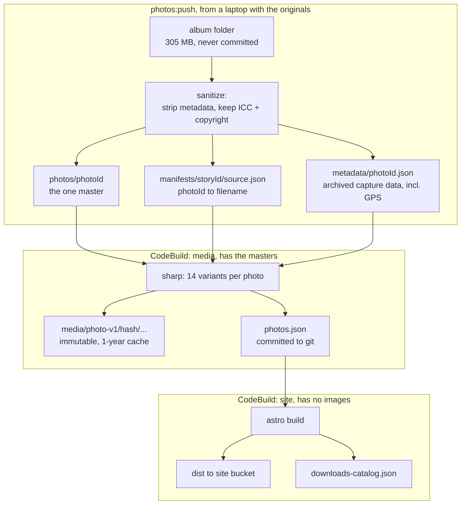
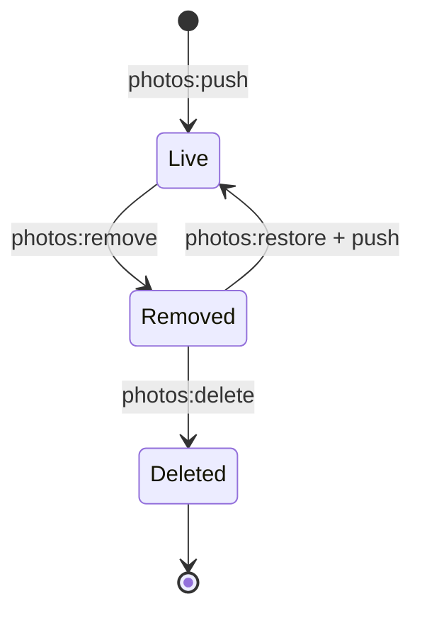

# Photo architecture

How photographs are stored, published, and served, and where this deliberately
departs from a conventional Astro site.

## The constraint everything follows from

The photographs are not in git. 305 MB sits in `content/albums/`, all of it
ignored (`.gitignore:13-17`); the repository itself is 37 MB.

That single decision determines most of what follows. Astro's own image
pipeline — `astro:assets`, `<Picture />`, `getImage()` — resolves and transforms
sources at site-build time. The site build never has them. So derivative
generation has to happen somewhere that does, which is why there are two build
jobs instead of one, and why a generated manifest sits between them.

Everything else here is either a consequence of that, or a consequence of
selling some of the photographs.

## Where truth lives

Four layers, each with one job. Nothing is authoritative in two places.

| Layer | Location | Authoritative for |
| --- | --- | --- |
| **Content**, authored | `content/albums/<dir>/index.md` | album fields; ordered membership with `photoId`, `file`, `caption`, `alt`, `price`, `removed`/`deleted` |
| **Build contract**, generated | `content/albums/<dir>/photos.json` | `sourceHash`, dimensions, `shot`, variant URLs |
| **Bytes** | S3 `adamficke-com-originals` | `photos/<photoId>`, `metadata/<photoId>.json` |
| **Store** | generated + runtime | `downloads-catalog.json`; DynamoDB orders |

Album membership is authored; everything derived from the pixels is generated.
The manifest is a build artifact, not content — it is never hand-edited, and its
only reader is `src/lib/albums.ts`.

Two values are denormalized on purpose, as provenance rather than truth: each
master carries `x-amz-meta-album` and `x-amz-meta-file`, so a lone S3 object is
self-describing, and each order snapshots `albumTitle` and `label` at checkout so
a past sale still reads correctly after an album is renamed.

## The two pipelines

The media build runs per album and only when photographs change. The site build
runs on every content change and consumes only `photos.json` — which is exactly
why that file must be committed.

`buildspec-site.yml:29` also runs `photos:gc` after a successful deploy, so
derivative cleanup is part of publishing rather than a separate chore.

## Serving

One CloudFront distribution, three origins:

| Path | Origin | Notes |
| --- | --- | --- |
| `/media/*` | media bucket (private) | content-addressed, `immutable`, one-year cache |
| `/api/*` | API Gateway REST → Lambda | checkout, webhook, fulfillment, download |
| everything else | site bucket (private) | static Astro output |

`/downloads-catalog.json` is published by the site build but **404s at the edge**
(`infra/main.tf:124`). The buyer Lambda reads it straight from the private site
bucket over IAM. The originals bucket has no CloudFront origin at all; the only
way bytes leave it is a presigned URL minted per download.

## Identity

`photoId` is `photo_` plus 24 random hex characters, minted once by
`photos:push` and written to album frontmatter. It names the S3 master, joins
frontmatter to the manifest, and is what an order records.

It is deliberately **not** derived from the bytes. A photograph is a stable fact
whose pixels may improve: re-exporting at a higher resolution overwrites
`photos/<photoId>` in place, and every download link already issued starts
serving the better file.

Worth being clear about what this costs and why. Without the store there would
be no `photoId` at all — `sourceHash` would key the masters and derivatives, and
filenames would handle human reference. Stable identity exists solely so an
order placed today still resolves after a rename, a reorder, or a re-export.
That is the store's entire footprint on the photo model: one field per photo,
plus a catalog file.

`sourceHash` still exists, but only as a derivative cache key and change
detector. It is not identity.

## Lifecycle

**Live** — in the album, derivatives served, purchasable if it has a `price`.

**Removed** — out of the album and out of the catalog, master retained so anyone
who already bought it keeps a working download. The derivative tree becomes
obsolete, and the next site deploy's `photos:gc` deletes it, which is what
actually stops the image being fetchable at its CloudFront URL. Reversible, but
restoring after that deploy needs a rebuild rather than a flag flip.

**Deleted** — bytes destroyed. Only reachable from `removed`, so nothing on the
site can vanish in one step. The frontmatter entry stays as the record that the
photograph existed, which is also what stops a later push minting a fresh ID for
it. Download links return `410`. Bucket versioning keeps 90 days of undo.

Deleting a file from an album folder is not part of this. `photos:push` refuses
and names the command, because dropping the entry would discard the record and
orphan the master.

## Deviations from a conventional Astro architecture

| Convention | What this does instead | Why |
| --- | --- | --- |
| Images in `src/assets/`, transformed by `astro:assets` | Originals in S3; a separate CodeBuild job runs sharp against a pinned profile | 305 MB does not belong in git, and the site build never sees the sources |
| One build | Two: media (per album, on demand) and site (every change) | Only one of them has the photographs |
| Derived data recomputed each build | `photos.json` committed as a build contract | The site build cannot recompute what it cannot see |
| Structured data as a content collection | `photos.json` read through `import.meta.glob` | It is a generated artifact, not authored content. A collection would give it a schema, at the cost of treating a build cache as an entity |
| SSR endpoints or adapters for dynamic work | Static output; commerce is Lambda behind the same distribution at `/api/*` | The site is static files on S3. Commerce needs secrets, DynamoDB, and a lifecycle independent of content deploys |
| Server config deployed with the server | The site build emits `downloads-catalog.json`, which CloudFront 404s and the Lambda reads over IAM | Putting a photograph on sale becomes a content deploy rather than a Lambda deploy |

The last row is the one worth internalizing: the site build is used as the
*publishing mechanism* for server-side configuration. Price and sale state live
in album frontmatter, travel through the ordinary content pipeline, and reach
the Lambda within its 60-second cache — with no Lambda deploy and no second
place to edit.

Everything above is a consequence of the images not being in git, or of running
a store on a static site. Where neither applies, this is an ordinary Astro
content-collection site: `content.config.ts` defines the album schema, zod
validates it at build, and `getCollection` is how pages read it.

## Deliberately not done

**A `photos` content collection.** Merging the eight manifests into one
registry keyed by `photoId` would add zod validation and make duplicate IDs hard
to produce. It would also promote a build artifact to a content entity, replace
a whole-file write with a read-modify-write across a shared file, and scatter
album history into one file's log. The uniqueness problem it solves is worth
about eight lines in `getAlbums()`. If manifest validation ever genuinely bites,
the cheaper answer is a `glob()` loader over the existing per-album files, which
adds a schema without any merging.

**One photograph in several albums.** Identity is scoped to a single album's
membership list. Supporting reuse means a photograph record independent of any
album, which is not worth it at eight albums. Nothing here blocks it later.

**Astro's image service for album photos.** Not available while the sources are
absent at build time. The site's own non-album images can still use it.
