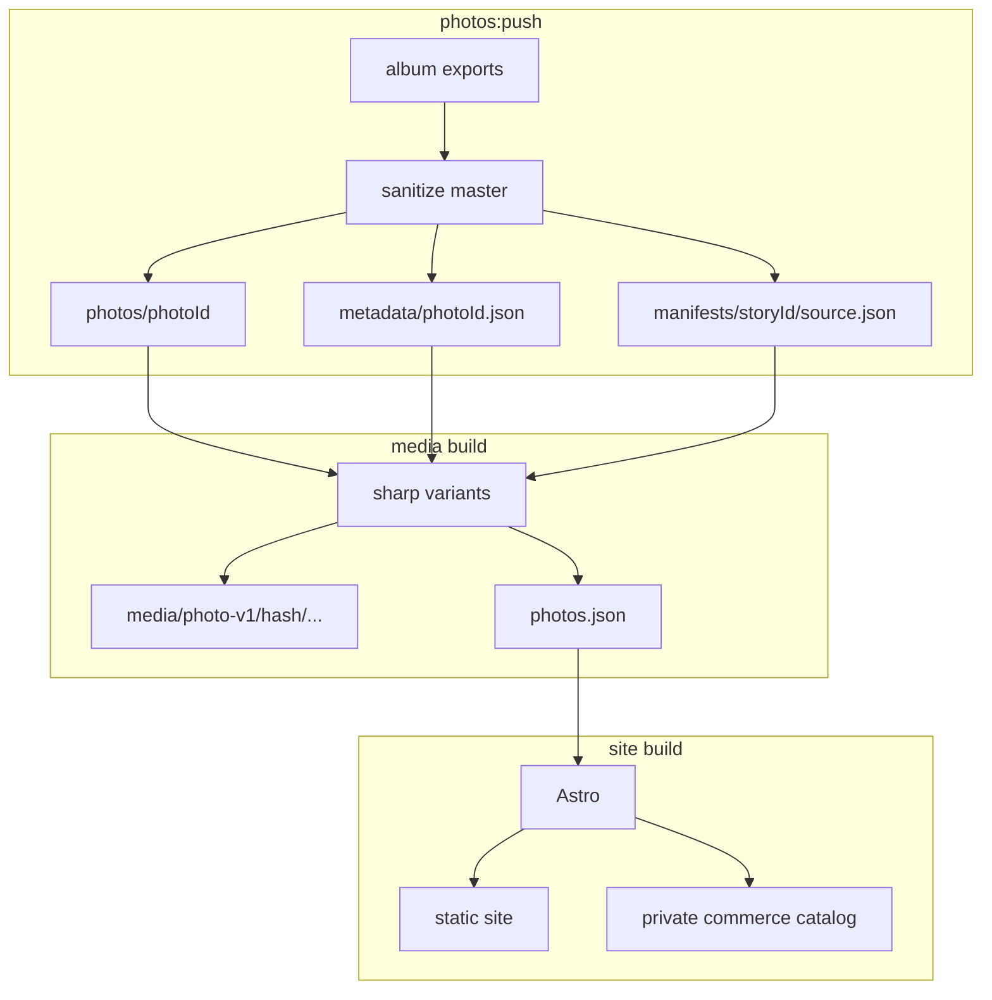
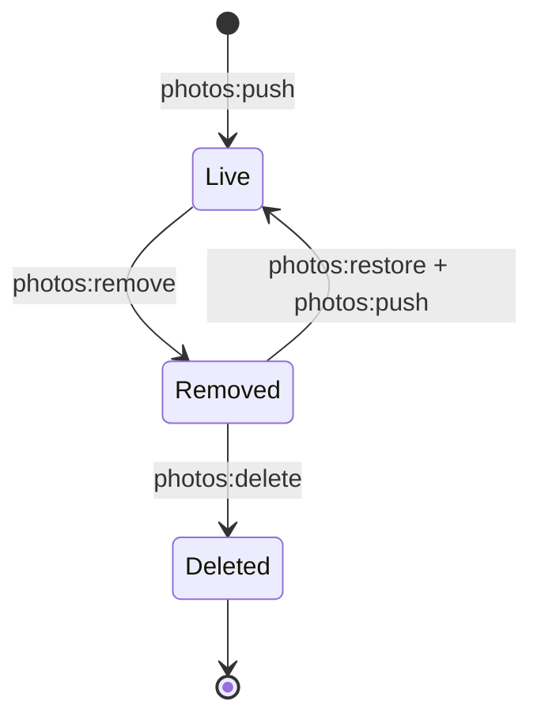

# Photo architecture

Photograph masters are private, are not committed to Git, and are also the
files delivered to buyers. Those constraints separate media generation from the
static Astro build.

## Storage model

Each photograph has a permanent `photoId` and two private objects:

```text
photos/<photoId>            metadata-minimized full-resolution master
metadata/<photoId>.json     archived capture metadata, including GPS
```

The media build reads these objects and writes immutable, content-addressed
derivatives. The site build reads committed manifests and never downloads a
master. This separation keeps full-resolution files private, avoids reprocessing
the archive for text-only changes, and preserves long-lived derivative URLs.

## Sources of truth

Each layer owns a different kind of state:

| Layer | Location | Authoritative for |
| --- | --- | --- |
| Authored content | `content/albums/<dir>/index.md` | Album fields, display order, captions, alt text, price, and lifecycle dates |
| Media output | `content/albums/<dir>/photos.json` | Source hash, dimensions, shot metadata, and derivative URLs |
| Media input | S3 `manifests/<storyId>/source.json` | Photo IDs and filenames included in a media build |
| Private bytes | S3 `photos/` and `metadata/` | Full-resolution masters and archived metadata |
| Commerce | private catalog and DynamoDB | Current offers and durable orders |

`index.md` contains human decisions and cannot be regenerated. `photos.json`
contains measured and generated media facts and can be rebuilt from the masters.
It is committed because the site build needs dimensions and URLs but cannot read
the source images.

The similarly named S3 `source.json` travels in the other direction. It is the
input written by `photos:push` so the media build knows which masters belong to
the album.

Each master also carries album and filename metadata for provenance. These
values are descriptive rather than authoritative: an album or filename can
change without changing the photograph's identity.

## Publishing pipelines



`photos:push` losslessly strips GPS, camera, editing, and descriptive metadata
from the uploaded master while retaining its color profile and approved
copyright fields. The removed metadata is archived in the sidecar. The same
media generator runs locally or in CodeBuild.

The media build emits AVIF, WebP, and JPEG responsive variants, a lightbox
variant, and a social-preview image. Variant paths include the source hash, so
unchanged photographs reuse existing objects and changed bytes receive new
immutable URLs.

The site build runs on every merge to `main`. It reads `index.md` and
`photos.json`, deploys static output, invalidates mutable CloudFront paths, and
attempts `photos:gc` only after the new pages are available. Cleanup failure is
reported in the CodeBuild log and retried by the next deploy; it does not turn
an already-published site update into a failed deployment.

## Serving

One CloudFront distribution uses three origins:

| Path | Origin | Cache behavior |
| --- | --- | --- |
| `/media/*` | private media bucket | One year, `immutable` |
| `/api/*` | API Gateway and Lambda | Disabled |
| Everything else | private site bucket | Static-site policy |

`/downloads-catalog.json` exists in the site bucket but returns `404` through
CloudFront. Buyer reads it directly through IAM. The originals bucket is not a
CloudFront origin; full-resolution bytes leave it only through short-lived,
presigned download URLs.

## Identity

`photoId` is `photo_` plus 24 random hexadecimal characters. `photos:push`
mints it once and writes it to frontmatter. It names the master, joins
frontmatter to `photos.json`, and is the photograph reference stored on an
order.

Identity is independent of bytes. Re-exporting a photograph overwrites
`photos/<photoId>` so existing download links serve the current master.
`sourceHash` changes with the bytes and is used only for derivative caching and
change detection.

`storyId` is the permanent album identity. Album directory names, filenames,
titles, captions, ordering, and cover choice may change without changing either
identity.

## Lifecycle



- **Live:** The photograph appears in its album, has public derivatives, and is
  purchasable when it has a price.
- **Removed:** The photograph leaves the album and catalog, but its master
  remains available to existing buyers. The next `photos:gc` deletes unreferenced
  derivatives. Restoration rebuilds them from the master.
- **Deleted:** The master and metadata are deleted after explicit confirmation.
  The frontmatter entry remains as a tombstone, download attempts return `410`,
  and S3 versioning provides a 90-day recovery window.

Deleting a file from an album directory is not a lifecycle transition.
`photos:push` stops when a live file disappears so identity and purchase records
cannot be discarded accidentally.
